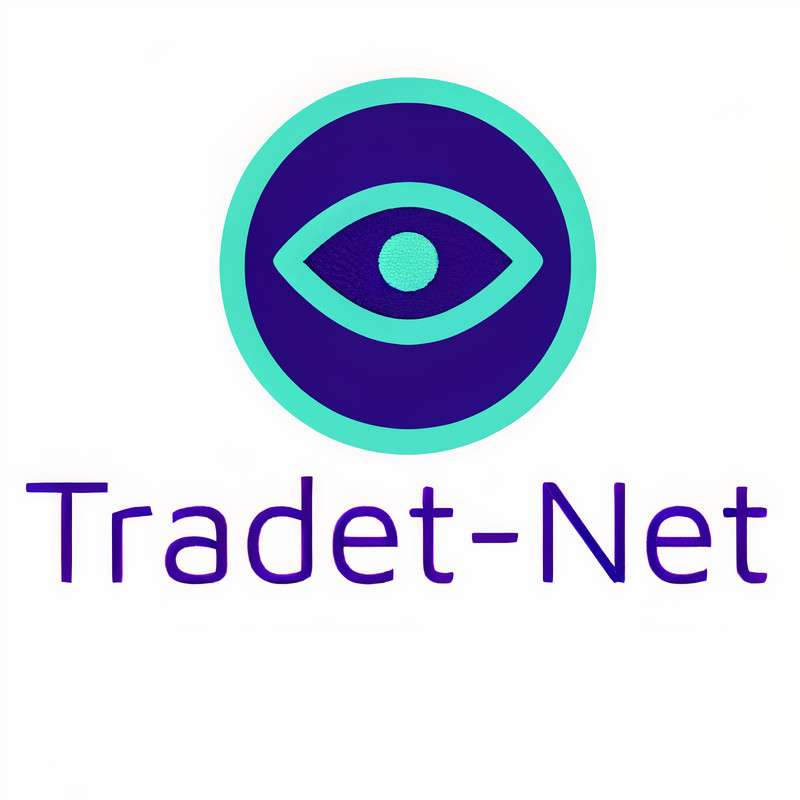

 <p align="center">
  
</p> 


  


Tradet-Net is a software for the detection, monitoring and estimation of distances between people on videos. Its base technology is the Yolov3 deep learning model, and the DeepSort tracking algorithm.

<p align="center">
  
</p> 


# Installation

## Requirements

* Python 3.9
* Operative System 64 bits
* RAM more or equal to 4GB


## Download 

Clone the repository, create virtual environment and install packages

```bash
git clone --branch production https://github.com/jvech/DeepSort_Yolo.git

cd DeepSort_Yolo

python3 -m venv env

source env/bin/activate
```

```bash
# TensorFlow CPU
pip3 install -r requirements.txt

# TensorFlow GPU
pip3 install -r requirements-gpu.txt
```

## Download pretrained weights and convert them to format for tensorflow

```bash
wget https://pjreddie.com/media/files/yolov3.weights -O weights/yolov3.weights

python3 load_weights.py
```

## Run 

```bash
python3 main.py
```


